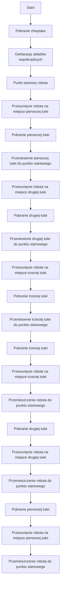

```mermaid
  graph TD;
      Start-->B[Pobranie chwytaka];
      B-->C[Deklaracja układów\nwspółrzędnych];
      C-->D1[Punkt startowy robota];

      D1-->D2[Przesunięcie robota na miejsce pierwszej tulei]
      D2-->D3[Pobranie pierwszej tulei]
      D3-->E1[Przeniesienie pierwszej tulei do punktu startowego]

      E1-->E2[Przesunięcie robota na miejsce drugiej tulei]
      E2-->E3[Pobranie drugiej tulei]
      E3-->F1[Przeniesienie drugiej tulei do punktu startowego]

      F1-->F2[Przesunięcie robota na miejsce trzeciej tulei]
      F2-->F3[Pobranie trzeciej tulei]
      F3-->G1[Przeniesienie trzeciej tulei do punktu startowego]

      G1-->G2[Pobranie trzeciej tulei]
      G2-->G3[Przesunięcie robota na miejsce trzeciej tulei]
      G3-->H1[Przemieszczenie robota do punktu startowego]

      H1-->H2[Pobranie drugiej tulei]
      H2-->H3[Przesunięcie robota na miejsce drugiej tulei]
      H3-->I1[Przemieszczenie robota do punktu startowego]

      I1-->I2[Pobranie pierwszej tulei]
      I2-->I3[Przesunięcie robota na miejsce pierwszej tulei]
      I3-->I4[Przemieszczenie robota do punktu startowego]
  
```
