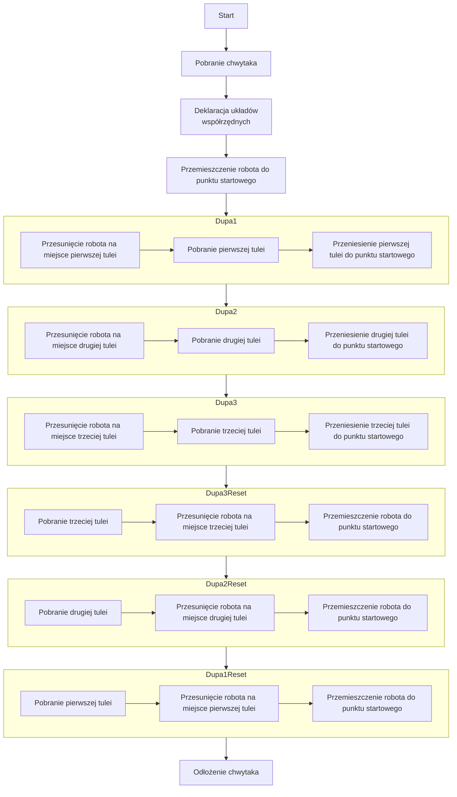

```mermaid
  flowchart TD;
  Start-->B[Pobranie chwytaka];
  B-->C1[Deklaracja układów\nwspółrzędnych];
  C1-->C[Przemieszczenie robota do punktu startowego]

subgraph tuleja1 [Dupa1]
  D2[Przesunięcie robota na miejsce pierwszej tulei]-->D3[Pobranie pierwszej tulei]
  D3-->D4[Przeniesienie pierwszej tulei do punktu startowego]
end

subgraph tuleja2 [Dupa2]
  E2[Przesunięcie robota na miejsce drugiej tulei]-->E3[Pobranie drugiej tulei]
  E3-->E4[Przeniesienie drugiej tulei do punktu startowego]
end
subgraph tuleja3 [Dupa3]
  F2[Przesunięcie robota na miejsce trzeciej tulei] -->F3[Pobranie trzeciej tulei]
  F3-->F4[Przeniesienie trzeciej tulei do punktu startowego]
end


C-->tuleja1
tuleja1 --> tuleja2
tuleja2 -->tuleja3
tuleja3 -->tuleja3reset


subgraph tuleja3reset [Dupa3Reset]
  G2[Pobranie trzeciej tulei]-->G3[Przesunięcie robota na miejsce trzeciej tulei]
  G3-->G4[Przemieszczenie robota do punktu startowego]
end

subgraph tuleja2reset [Dupa2Reset]
  H2[Pobranie drugiej tulei]-->H3[Przesunięcie robota na miejsce drugiej tulei]
  H3-->I1[Przemieszczenie robota do punktu startowego]
end
subgraph tuleja1reset [Dupa1Reset]
  I2[Pobranie pierwszej tulei] -->I3[Przesunięcie robota na miejsce pierwszej tulei]
  I3-->I4[Przemieszczenie robota do punktu startowego]
end


       
tuleja3reset -->tuleja2reset
tuleja2reset -->tuleja1reset

      tuleja1reset-->J[Odłożenie chwytaka]
  
```
