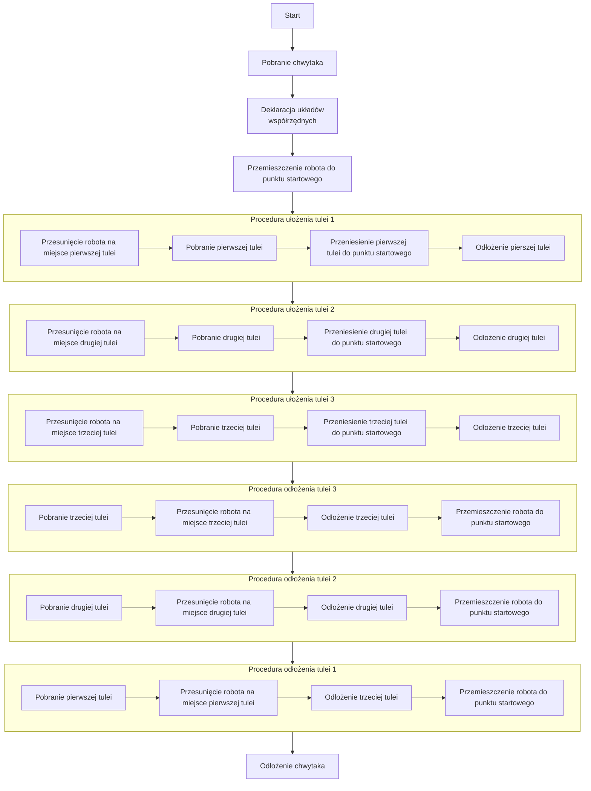

```mermaid
  flowchart TD;

subgraph tuleja1 [Procedura ułożenia tulei 1]
  D2[Przesunięcie robota na miejsce pierwszej tulei]-->D3[Pobranie pierwszej tulei]
  D3-->D4[Przeniesienie pierwszej tulei do punktu startowego]
  D4-->D5[Odłożenie pierszej tulei]
end

subgraph tuleja2 [Procedura ułożenia tulei 2]
  E2[Przesunięcie robota na miejsce drugiej tulei]-->E3[Pobranie drugiej tulei]
  E3-->E4[Przeniesienie drugiej tulei do punktu startowego]
  E4-->E5[Odłożenie drugiej tulei]
end

subgraph tuleja3 [Procedura ułożenia tulei 3]
  F2[Przesunięcie robota na miejsce trzeciej tulei] -->F3[Pobranie trzeciej tulei]
  F3-->F4[Przeniesienie trzeciej tulei do punktu startowego]
  F4-->F5[Odłożenie trzeciej tulei]
end

subgraph tuleja3reset [Procedura odłożenia tulei 3]
  G2[Pobranie trzeciej tulei]-->G3[Przesunięcie robota na miejsce trzeciej tulei]
  G3-->G4[Odłożenie trzeciej tulei]
  G4-->G5[Przemieszczenie robota do punktu startowego]
end

subgraph tuleja2reset [Procedura odłożenia tulei 2]
  H2[Pobranie drugiej tulei]-->H3[Przesunięcie robota na miejsce drugiej tulei]
  H3-->H4[Odłożenie drugiej tulei]
  H4-->H5[Przemieszczenie robota do punktu startowego]
end

subgraph tuleja1reset [Procedura odłożenia tulei 1]
  I2[Pobranie pierwszej tulei] -->I3[Przesunięcie robota na miejsce pierwszej tulei]
  I3-->I4[Odłożenie trzeciej tulei]
  I4-->I5[Przemieszczenie robota do punktu startowego]
end

Start-->B[Pobranie chwytaka];
B-->C1[Deklaracja układów\nwspółrzędnych];
C1-->C[Przemieszczenie robota do punktu startowego]
C-->tuleja1
tuleja1 --> tuleja2
tuleja2 -->tuleja3
tuleja3 -->tuleja3reset
tuleja3reset -->tuleja2reset
tuleja2reset -->tuleja1reset
tuleja1reset-->J[Odłożenie chwytaka]
  
```
